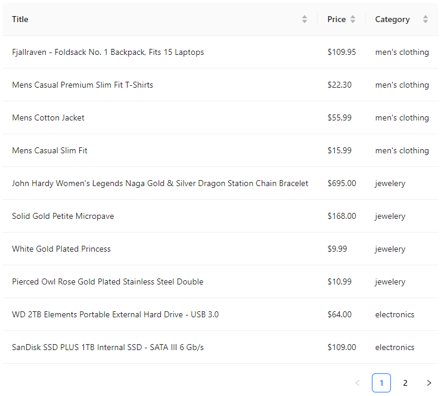

# E-commerce MVP

This project is an MVP (Minimum Viable Product) for an e-commerce platform developed by The Bridge's IT department.

## Overview

The project utilizes React and Redux to fetch and display product data from an external API. It showcases a table view of products with columns for Title, Price, and Category. Users can sort the table by clicking on column headers and perform basic pagination.

  

## Installation

1. Clone the repository.
2. Install dependencies: `npm install`.
3. Run the application: `npm start`.

## Usage

1. Upon running the app, the product table will be displayed.
2. Click on column headers to sort the table by Title, Price, or Category.
3. Pagination functionality allows navigating through multiple pages.

## External APIs

The application fetches product data from the [Fake Store API](https://fakestoreapi.com/).

## Acknowledgments

This project is a demonstration of a basic e-commerce MVP using React, Redux, and Ant Design for UI components.

 
 